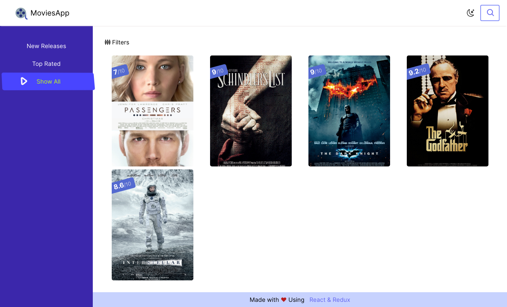
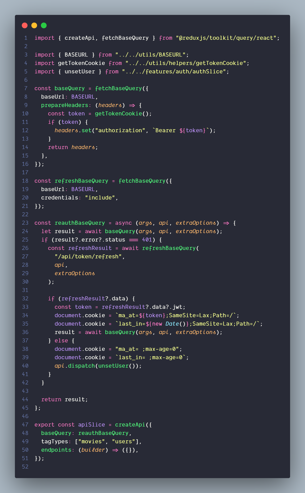

## About MovieApp

Movie Search App with Admin Dashboard to add, delete or update a movie, with the ability to add more admins, the use will be able to search and get the full detail of a movie.

<table>
    <tr>
        <td>Name</td>
        <td style="font-weight: bold">MovieApp</td>
    </tr>
    <tr>
        <td>Backend</td>
        <td style="font-weight: bold">Strapi</td>
    </tr>
    <tr>
        <td>Frontend</td>
        <td style="font-weight: bold">React</td>
    </tr>
    <tr>
        <td>Database</td>
        <td style="font-weight: bold">MySQL</td>
    </tr>
    <tr>
        <td>State</td>
        <td style="font-weight: bold;color:red">In Development</td>
    </tr>
    <tr>
        <td>URL</td>
        <td style="font-weight: bold;color:blueviolet">
            <a href="http://strapimovie.assanimed.me:7000" target="_blank">
                Link
            </a>
         </td>
    </tr>
</table>

### Code Simple for RTK query API 

